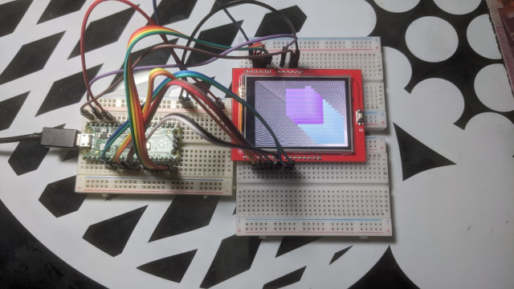

# RP2040 - 8bit parallel ILI9341

This demo create a base project for ILI9341 with 8bit parallel port and PIO from
RP2040.



## Connections

 * VBus -> 5V
 * GND -> GND
 * 3.3 -> 3.3
 * LCD[0:7]  -> GP[4:11]
 * RD -> GP12
 * WR -> GP13
 * RS -> GP14
 * CS -> GP15
 * RESET -> 3.3

## Library

this project can be used as library just use the `src` folder during you project
build 

```cmake
add_subdirectory(libs/rp2040-ili9341/src)
```

and then add the library `libili9341` in your `target_link_libraries`

```cmake
target_link_libraries(${PROJECT_NAME}
    PUBLIC
    pico_stdlib
    libili9341)
```